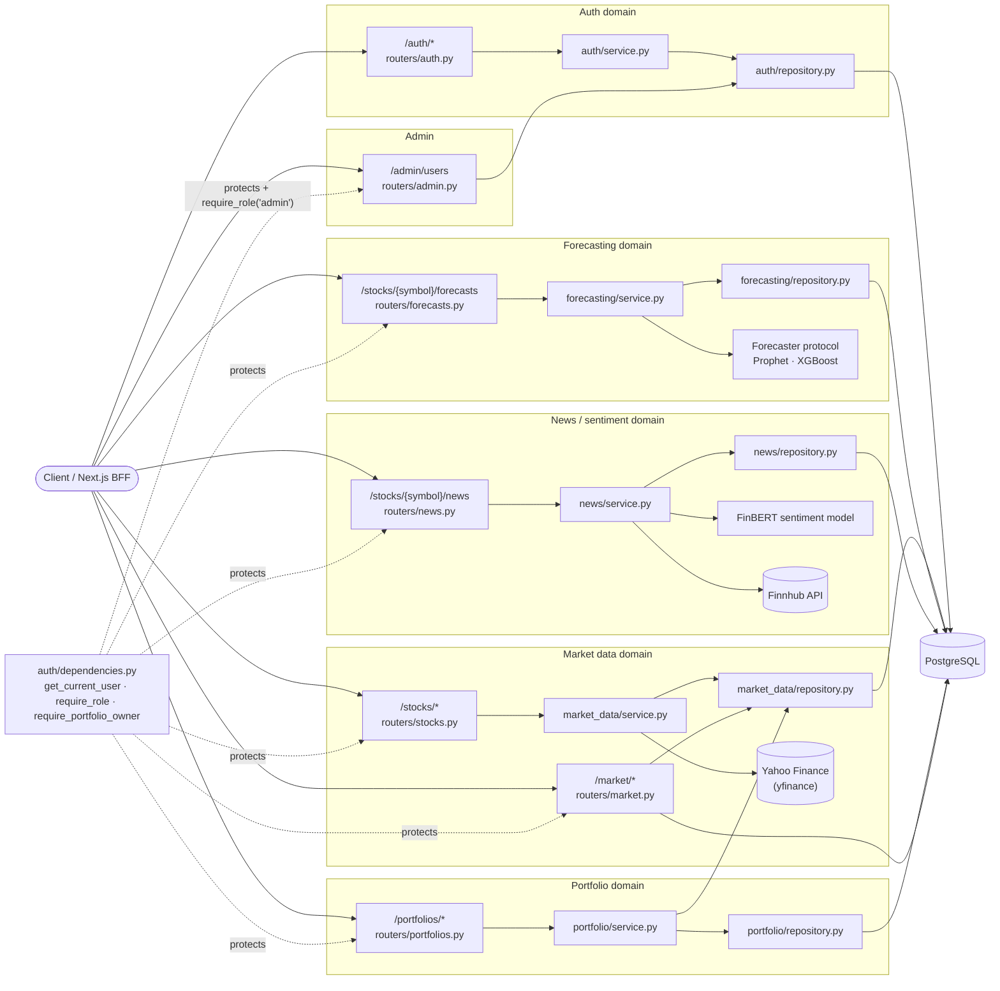

# Stoq — AI Financial Intelligence Platform

A FastAPI/PostgreSQL backend and Next.js frontend combining stock forecasting
(Prophet, XGBoost), news sentiment (FinBERT), and portfolio analytics. Built
as a demonstration of production-oriented backend engineering: clean layering,
a threat-model-driven security suite (see [`SECURITY.md`](SECURITY.md)), and
an architecture-decision log for every non-trivial choice
([`docs/DECISIONS.md`](docs/DECISIONS.md)).

## Stack

- **Backend:** FastAPI, SQLAlchemy 2.x (ORM), Alembic, PostgreSQL
- **ML/NLP:** Prophet, XGBoost, FinBERT (Transformers)
- **Frontend:** Next.js, TypeScript, Tailwind, TanStack Query, Recharts
- **Auth:** JWT (OAuth2 password flow), bcrypt password hashing

## Architecture

Each domain follows the same layering: **Router → Service → Repository →
Provider/DB**. `auth`'s `get_current_user` (plus `require_role` and
`require_portfolio_owner`) is a cross-cutting dependency injected into every
protected router.



`/market/*` reads across the market-data, forecast, and news tables to build
cross-stock aggregates (overview, signals, sentiment), so it queries the DB
directly in addition to `StockRepository`.

## Security

See [`SECURITY.md`](SECURITY.md) for the threat model, the mitigations in
place, and how to run the security regression suite
(`backend/tests/test_security.py`).

## Getting started

See [`backend/README.md`](backend/README.md) and
[`frontend/README.md`](frontend/README.md) for local setup, or:

```bash
docker compose up --build   # db + backend (migrations run on start)
```

## Documentation

- [`docs/DECISIONS.md`](docs/DECISIONS.md) — architecture decision log
- [`docs/API_Spec.md`](docs/API_Spec.md) — implemented API surface
- [`docs/Roadmap.md`](docs/Roadmap.md) / [`docs/Tasks.md`](docs/Tasks.md) — phase status
